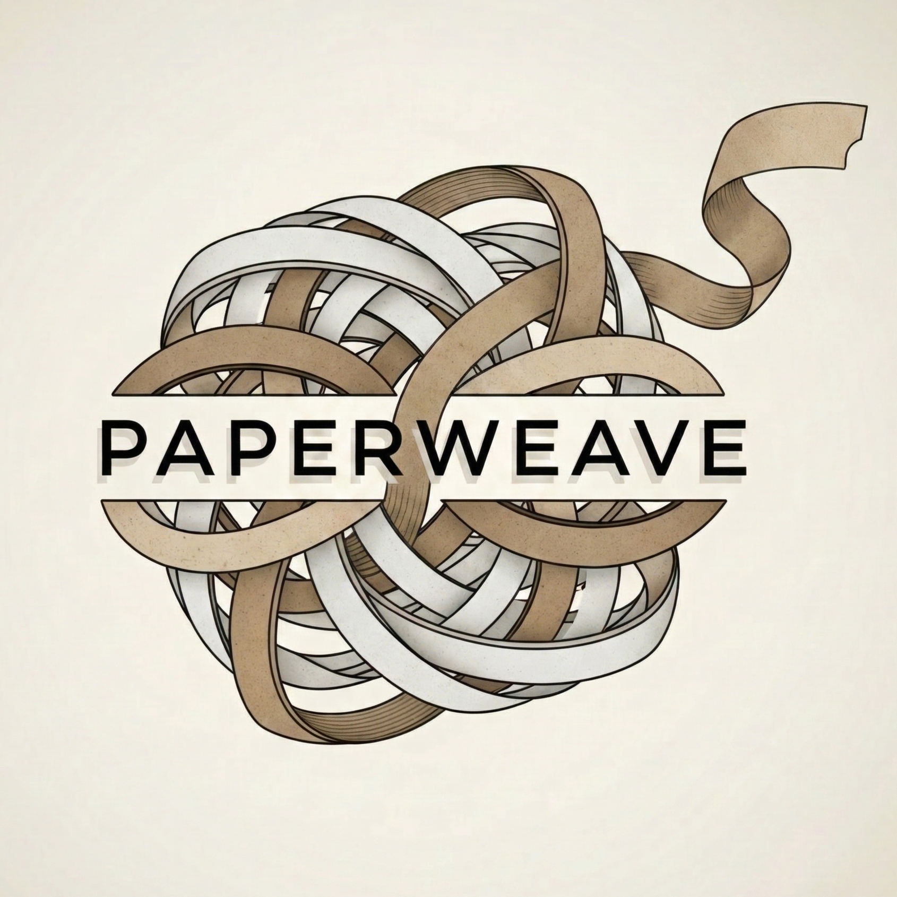

<p align="center">
  
</p>

# PaperWeave（溯源文库）

> Local-first CLI for turning PDF papers into a structured research library with parsing, summaries, Q&A, citation tracking, and Markdown exports.

PaperWeave 是一个面向研究者的本地论文工作流工具。它把一批 PDF 论文整理成可持续更新的研究资产：正文结构、结构化摘要、深度问答、引用关系和可阅读的 Markdown 导出。

## 核心能力

- 导入单个 PDF 或整个文件夹，支持递归扫描和 SHA256 去重。
- 解析论文正文与章节结构，arXiv 论文优先使用 DeepXiv，其他 PDF 使用 PyMuPDF。
- 生成结构化 Summary 和 reviewer / interview / author-defense 风格 QA。
- 追踪经典论文的 forward citations，并保存 OA 链接、DOI 页面和引用边。
- 使用 SQLite 作为唯一事实来源，Markdown 只是导出层。
- 支持增量运行：文件、prompt、模型或任务输入变化后只重跑需要更新的部分。

## 快速开始

### 1. 安装

```bash
conda create -n paperweave python=3.10
conda activate paperweave
git clone https://github.com/hydelovegood/paperweave
cd paperweave
pip install -e .
```

也可以使用 venv：

```bash
python -m venv .venv
.venv\Scripts\activate
pip install -e .
```

安装后可用命令：

```bash
paperweave --help
```

兼容别名 `paperctl` 仍然可用。

### 2. 配置密钥

复制 `.env.example` 为 `.env`，按需填写：

```env
DEEPXIV_TOKEN=
OPENAI_API_KEY=
SEMANTIC_SCHOLAR_API_KEY=
UNPAYWALL_EMAIL=
NCBI_API_KEY=
```

默认配置在 `configs/app.yaml`。通常只需要确认 LLM 服务地址、模型名、研究背景和导出路径。

### 3. 一条命令跑完整流程

准备一个论文文件夹，例如 `C:\papers\my-study`，然后运行：

```bash
paperweave init C:\research\paperweave
paperweave run C:\research\paperweave C:\papers\my-study --recursive
```

默认 `run` 会执行：

```text
ingest -> parse -> summarize -> qa -> export summary -> export qa
```

完成后查看：

- `data/exports/summary.md`
- `data/exports/QA.md`

调试时可在第一处失败停止：

```bash
paperweave run C:\research\paperweave C:\papers --recursive --fail-fast
```

## 常用命令

初始化项目：

```bash
paperweave init C:\research\paperweave
```

导入 PDF：

```bash
paperweave ingest C:\research\paperweave C:\papers --recursive
```

解析论文：

```bash
paperweave parse C:\research\paperweave --changed
paperweave parse C:\research\paperweave --all
```

生成摘要和 QA：

```bash
paperweave summarize C:\research\paperweave --changed
paperweave qa C:\research\paperweave --changed
```

强制重跑指定论文：

```bash
paperweave summarize C:\research\paperweave --paper-ids 1 2 3 --force
paperweave qa C:\research\paperweave --paper-ids 1 2 3 --force
```

追踪 forward citations：

```bash
paperweave citations forward C:\research\paperweave --paper-ids 9 --year-start 2024 --year-end 2026 --max-results 20
```

导出结果：

```bash
paperweave export summary C:\research\paperweave
paperweave export qa C:\research\paperweave
```

检查环境：

```bash
paperweave doctor C:\research\paperweave
paperweave doctor C:\research\paperweave --check-llm
```

## 工作流与数据模型

```text
PDF folder
   |
   v
ingest -> files / papers
   |
   v
parse -> CanonicalPaper + sections
   |
   v
summary / qa / citations
   |
   v
SQLite + parsed JSON + raw logs
   |
   v
summary.md / QA.md
```

主要状态字段：

- `parse_status`
- `summary_status`
- `qa_status`
- `citation_status`

常见状态值：

- `pending`
- `done`
- `failed`
- `stale`

## 项目结构

```text
paperlab/
├─ configs/              # app.yaml and prompt templates
├─ data/                 # parsed JSON, cache, exports, logs
├─ db/                   # SQLite database
├─ src/paperlab/
│  ├─ cli/               # CLI commands
│  ├─ config/            # settings loader
│  ├─ ingest/            # PDF discovery and registration
│  ├─ parsing/           # DeepXiv / PyMuPDF parsing pipeline
│  ├─ enrich/            # citation and metadata clients
│  ├─ llm/               # summary and QA generation
│  ├─ export/            # Markdown exports
│  └─ storage/           # schema and task state
└─ tests/
```

## 配置说明

`configs/app.yaml` 的核心字段：

```yaml
database:
  path: db/papers.db

paths:
  parsed_dir: data/parsed
  cache_dir: data/cache
  export_dir: data/exports
  logs_dir: data/logs

llm:
  base_url: https://open.bigmodel.cn/api/coding/paas/v4
  summary_model: glm-5.1
  qa_model: glm-5.1
  lang: zh
  max_retries: 2
  research_context: "multi-agent reinforcement learning"

citations:
  default_year_start: 2024
  default_year_end: 2026
  default_max_results: 30
  download_oa_only: true
```

`download_oa_only: true` 不会丢弃非 OA 论文；PaperWeave 仍会保存 DOI 或 landing page 链接。这个选项主要控制是否主动查询开放获取 PDF。

## 当前边界

- 目前是 CLI-first、single-user、local-first 工具。
- 没有 GUI 和后台 worker。
- forward-citation PDF 下载还不是完整闭环。
- 非 arXiv PDF 的解析质量取决于 PyMuPDF 可提取文本的质量。
- LLM 输出已经有结构校验，但高价值论文仍建议人工抽查。

## 安全提醒

- `.env` 可能包含真实 API key，不要提交。
- `data/logs/llm/` 会保存原始 LLM 输出。
- `db/papers.db` 会保存论文元数据、摘要、QA 和引用信息。
- 在共享机器上使用时，请保护项目目录权限。

## Roadmap

- 自动下载并接入 OA citing PDFs。
- 更强的 DOI / arXiv / OpenAlex / Semantic Scholar 对齐。
- 主题、方法、数据集标签。
- lineage / research-thread 报告。
- 更严格的 schema-constrained LLM 输出。
- 更丰富的 `doctor` 诊断。

## License

MIT. See [LICENSE](LICENSE).

## Acknowledgements

PaperWeave builds on or integrates with DeepXiv, PyMuPDF, OpenAlex, Semantic Scholar, Crossref, Unpaywall, PubMed/PMC, and OpenAI-compatible API clients.
