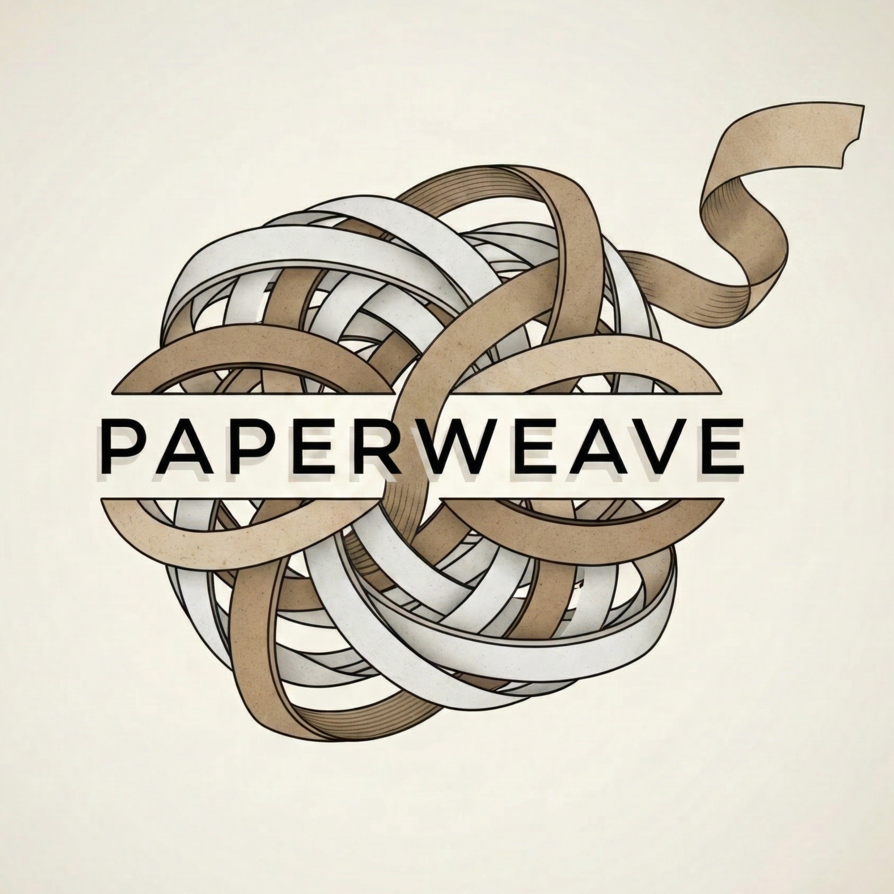

<p align="center">
  
</p>

# PaperWeave（溯源文库）

一个我自己在用的论文管理工具。把一堆 PDF 丢给它，它会解析出章节结构、生成结构化摘要和 QA、追踪引用关系，最后导出成能直接读的 Markdown。所有东西都存在本地，SQLite 是唯一的事实来源，导出的 md 只是给人看的。

为什么不用 Zotero + 插件：我想要的是"整个文库可以反复跑、增量更新、还能读"的东西——新增论文只重跑变化的部分，prompt 或模型换了也只重跑该重跑的，之前的摘要和 QA 都在数据库里留着。现成的工具凑起来总差一点，就自己写了。

目前能做的事：

- 导入单个 PDF 或整个文件夹（支持递归），SHA256 去重
- 解析章节结构，arXiv 论文走 DeepXiv，其他走 PyMuPDF
- 生成结构化摘要，以及 reviewer / interview / author-defense 几种风格的 QA
- 追踪经典论文的 forward citations，顺便存下 OA 链接和 DOI 页面
- 增量重跑：文件、prompt、模型变了只更新受影响的部分

## 快速开始

### 安装

```bash
conda create -n paperweave python=3.10
conda activate paperweave
git clone https://github.com/hydelovegood/paperweave
cd paperweave
pip install -e .
```

用 venv 也行。装完后命令是 `paperweave`，旧的 `paperctl` 别名也还在。

### 配密钥

复制 `.env.example` 成 `.env`，按需要填：

```env
DEEPXIV_TOKEN=
OPENAI_API_KEY=
SEMANTIC_SCHOLAR_API_KEY=
UNPAYWALL_EMAIL=
NCBI_API_KEY=
```

默认配置在 `configs/app.yaml`，一般只要确认 LLM 地址、模型名、`research_context`（你自己的研究背景，会写进摘要 prompt）和导出路径。

### 一条命令跑完

```bash
paperweave init C:\research\paperweave
paperweave run C:\research\paperweave C:\papers\my-study --recursive
```

`run` 默认执行 `ingest -> parse -> summarize -> qa -> export`。产物在：

- `data/exports/summary.md`
- `data/exports/QA.md`

想在第一个报错处停下来就加 `--fail-fast`；论文多的话可以加 `--concurrency 4` 让 summarize/qa 阶段并发调 LLM。

## 常用命令

```bash
# 初始化 / 导入
paperweave init C:\research\paperweave
paperweave ingest C:\research\paperweave C:\papers --recursive

# 解析（一般 --changed 就够了）
paperweave parse C:\research\paperweave --changed
paperweave parse C:\research\paperweave --all

# 摘要和 QA
paperweave summarize C:\research\paperweave --changed
paperweave qa C:\research\paperweave --changed

# 换了 prompt 想强制重跑某几篇
paperweave summarize C:\research\paperweave --paper-ids 1 2 3 --force

# 追踪 forward citations
paperweave citations forward C:\research\paperweave --paper-ids 9 --year-start 2024 --year-end 2026 --max-results 20

# 手动导出（run 里其实会自动跑）
paperweave export summary C:\research\paperweave
paperweave export qa C:\research\paperweave

# 环境自检，--check-llm 会真的发一次最小请求
paperweave doctor C:\research\paperweave
paperweave doctor C:\research\paperweave --check-llm
```

## 数据流

```text
PDF folder
   |
   v
ingest -> files / papers
   |
   v
parse -> CanonicalPaper + sections
   |
   v
summary / qa / citations
   |
   v
SQLite + parsed JSON + raw logs
   |
   v
summary.md / QA.md
```

每篇论文有 `parse_status`、`summary_status`、`qa_status`、`citation_status` 几个状态字段，取值 `pending` / `done` / `failed` / `stale`。文件一变，整条链下游都会标成 `stale`。

## 项目结构

```text
paperlab/
├─ configs/              # app.yaml 和 prompt 模板
├─ data/                 # 解析后的 JSON、缓存、导出、日志
├─ db/                   # SQLite
├─ src/paperlab/
│  ├─ cli/               # 命令行
│  ├─ config/            # 配置加载
│  ├─ ingest/            # PDF 发现与注册
│  ├─ parsing/           # DeepXiv / PyMuPDF 解析
│  ├─ enrich/            # 引用和元数据 API 客户端
│  ├─ llm/               # 摘要和 QA 生成
│  ├─ export/            # Markdown 导出
│  └─ storage/           # 表结构和任务状态
└─ tests/
```

## 配置

`configs/app.yaml` 大概长这样：

```yaml
database:
  path: db/papers.db

paths:
  parsed_dir: data/parsed
  cache_dir: data/cache
  export_dir: data/exports
  logs_dir: data/logs

llm:
  base_url: https://open.bigmodel.cn/api/coding/paas/v4
  summary_model: glm-5.1
  qa_model: glm-5.1
  lang: zh
  max_retries: 2
  research_context: "multi-agent reinforcement learning"

citations:
  default_year_start: 2024
  default_year_end: 2026
  default_max_results: 30
  download_oa_only: true
```

`download_oa_only: true` 不会丢掉非 OA 的论文——找不到开放全文时还是会存 DOI / landing page 链接，它只是控制要不要主动去查 OA PDF。

## 已知的问题

- 非 arXiv 的 PDF 解析质量全看 PyMuPDF 能抠出多少干净文本，扫描件基本没救
- forward-citation 的 PDF 下载还没完全打通
- LLM 输出有结构校验，但重要论文还是建议自己扫一眼
- 单人本地工具，没有 GUI，没有后台 worker，也没打算做成多人协作

## 安全提醒

- `.env` 里有真的 API key，别提交
- `data/logs/llm/` 存的是 LLM 原始输出
- `db/papers.db` 里是论文元数据、摘要、QA 和引用关系
- 共享机器上跑的话注意项目目录权限

## 想做的事

- OA citing PDF 自动下载
- DOI / arXiv / OpenAlex / Semantic Scholar 之间更靠谱的 id 对齐
- 主题、方法、数据集标签
- lineage / research-thread 报告
- LLM 输出的 schema 约束再收紧一点

## License

MIT. See [LICENSE](LICENSE).

用了 DeepXiv、PyMuPDF、OpenAlex、Semantic Scholar、Crossref、Unpaywall、PubMed/PMC 和 OpenAI 兼容 API。
